# Mermaid

Practising...

# Flowcharts
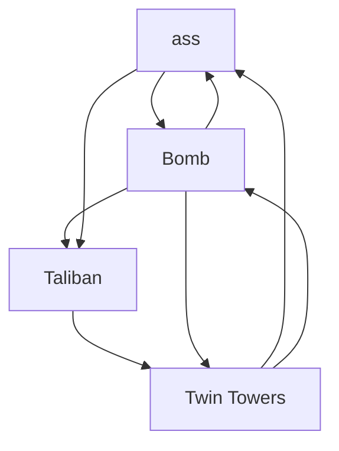
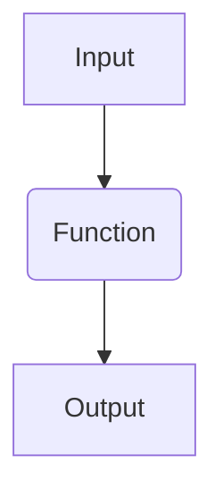
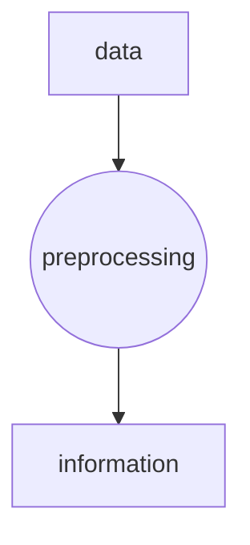
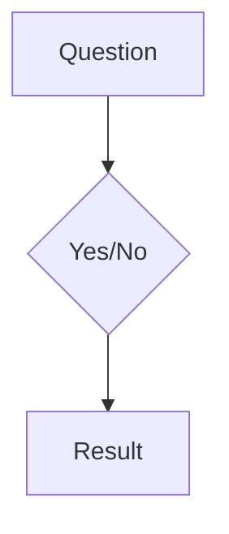
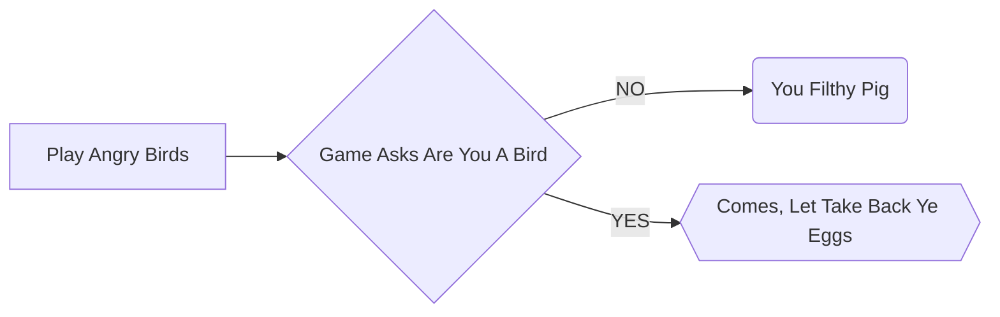
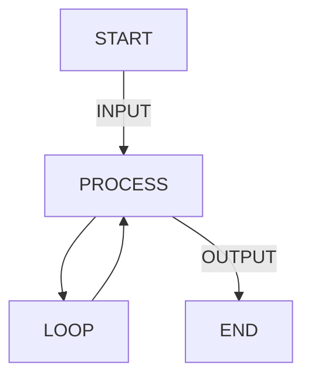
# Sequence Diagrams
<!--  autonumber for numbering in steps -->
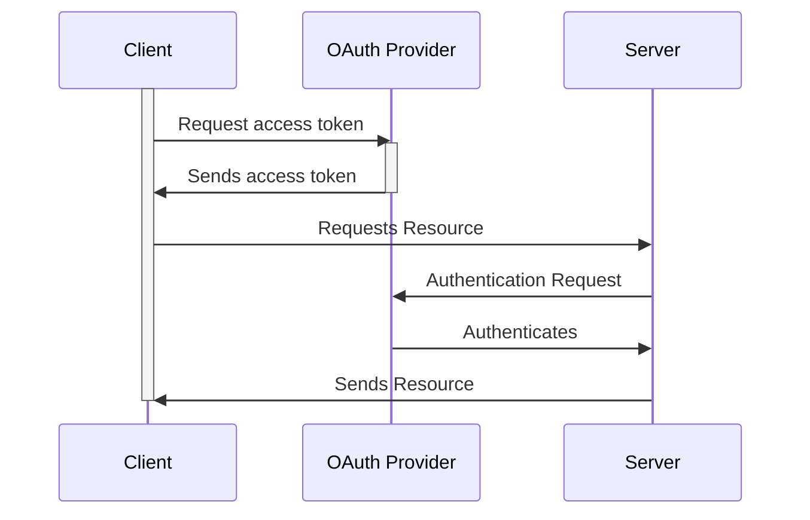
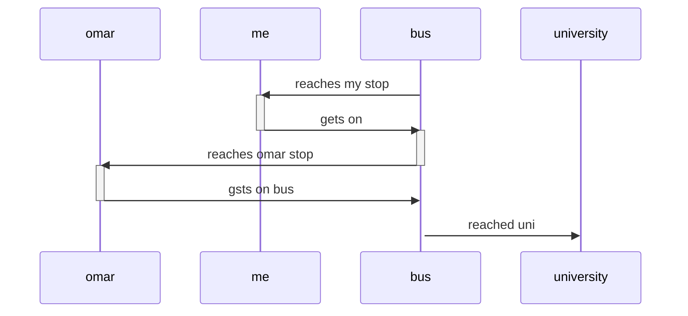
# Class Diagrams

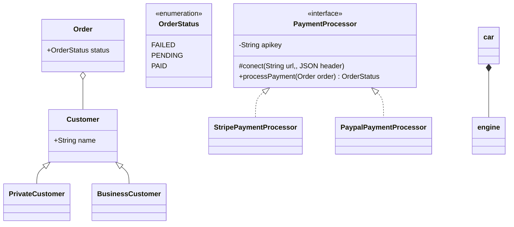
"o"  for aggregation
"*"  for composition

# Entity Relationship Diagrams
#### ERD == erDiagram
for a simple e-commerce system
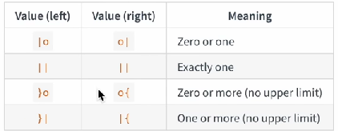
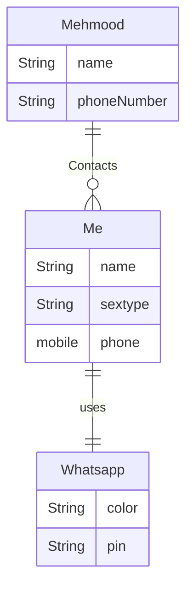