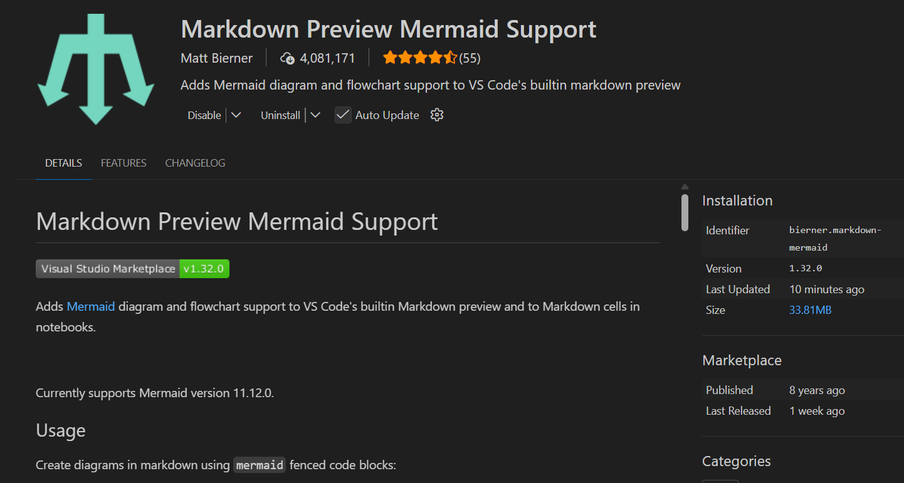
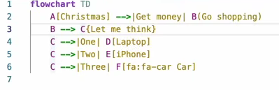
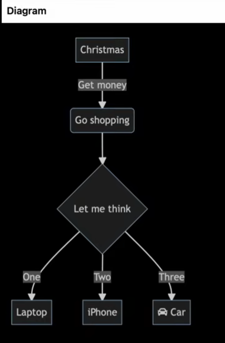
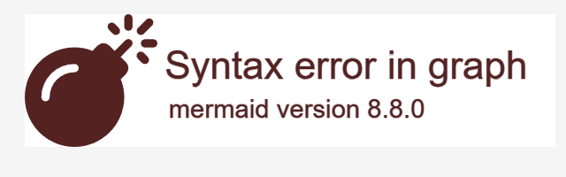

# Mermaid Language 2026

Practising and Developing, using Mermaid markdown Language.

[Download Mermaid Diagrams as PDF or Images From This Website](https://mermaid.live/edit#pako:eNpVjDFrw0AMhf-K0NRAPHXzEGjsNkugHTLVziBs2XckdzrkM6HY_u89J5S2mvT4vvcmbKRlzLG7yq0xpBFOZe0h3UtVGLVDdDScIct284EjOPH8NcP-6SAwGAnB-n7z8PerBMV0XDWGaKy_LA9U3PvvnmcoqyOFKOH8l5xuMsNrZT9Mmv9PjHJqvVUd5R1lDSkUpHcFt9irbTGPOvIWHaujNeK00hqjYcc15ultSS811n5JnUD-U8T91FTG3mDavg4pjaGlyKWlXulXYd-yFjL6iPnz8g2y-WNG])

# To Make It Work in Vscode Markdown ( mermaid.md - files), You Need Following Extension:

<!-- Name: Markdown Preview Mermaid Support
Id: bierner.markdown-mermaid
Description: Adds Mermaid diagram and flowchart support to VS Code's builtin markdown preview
Version: 1.32.0
Publisher: Matt Bierner
VS Marketplace Link: https://marketplace.visualstudio.com/items?itemName=bierner.markdown-mermaid -->
- **[Markdown Preview Mermaid Support](https://marketplace.visualstudio.com/items?itemName=bierner.markdown-mermaid)** 
- VS Code extension by Matt Bierner that adds Mermaid diagram support to markdown preview (v1.32.0)

- Mermaid Live Editor ( mermaid.live - website) is also a good choice to practice and develop Mermaid markdown Language. You can also download your diagrams as PDF or Images from this website.

#### To Write Mermaid markdown Language in Vscode, You Need Following Syntax:

```raw
    ```mermaid
            flowchart TD
                    A --> B
    ```
```

### ```mermaid

### ```

#### results in: 


#### syntax error:
