# 🧜‍♂️ The Ultimate Beginner's Guide to Mermaid.js

Mermaid is a JavaScript-based diagramming and charting tool that renders Markdown-inspired text definitions to create and modify diagrams dynamically. 

## 🛠️ 1. Environment Setup
To write and view Mermaid diagrams, you need an environment that supports it:
* **VS Code:** Install the **Markdown Preview Mermaid Support** extension. Create a `.md` file, write your code, and open the Markdown preview to see your diagrams live.
* **Browser:** Use the [Mermaid Live Editor](https://mermaid.live). It's great for quick testing, sharing links, and downloading your diagrams as PNG, SVG, or PDF files.

---

## 🌊 2. Flowcharts (Graphs)
Flowcharts are used to represent workflows, processes, or systems step-by-step.

### Defining the Direction
* `flowchart TD`: **T**op to **D**own (Vertical)
* `flowchart LR`: **L**eft to **R**ight (Horizontal)

### Example: Custom OS Boot Sequence
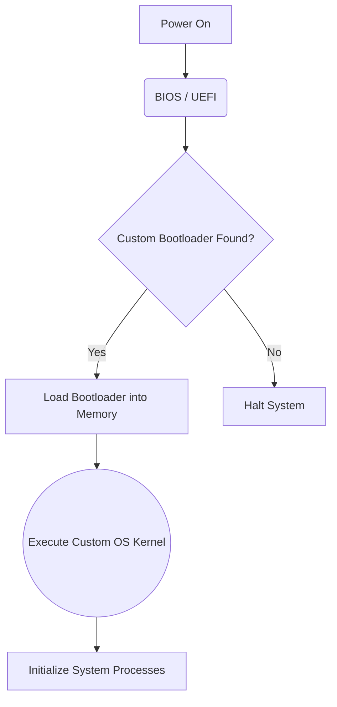
```mermaid
flowchart TD
    A[Power On] --> B(BIOS / UEFI)
    B --> C{Custom Bootloader Found?}
    C -->|Yes| D[Load Bootloader into Memory]
    C -->|No| E[Halt System]
    D --> F((Execute Custom OS Kernel))
    F --> G[Initialize System Processes]

```

---

## ⏱️ 3. Sequence Diagrams

Sequence diagrams show how processes operate with one another and in what order. They are perfect for mapping out system interactions, API calls, or inter-process communication (IPC).

### Core Syntax

* `participant [Name]`: Defines the actors/systems.
* `->>`: Solid line with arrowhead (Message/Request).
* `-->>`: Dotted line with arrowhead (Response/Return).
* `activate` / `deactivate`: Creates a vertical box on the participant's lifeline to show active processing.

### Example: Inter-Process Communication (fork & wait)

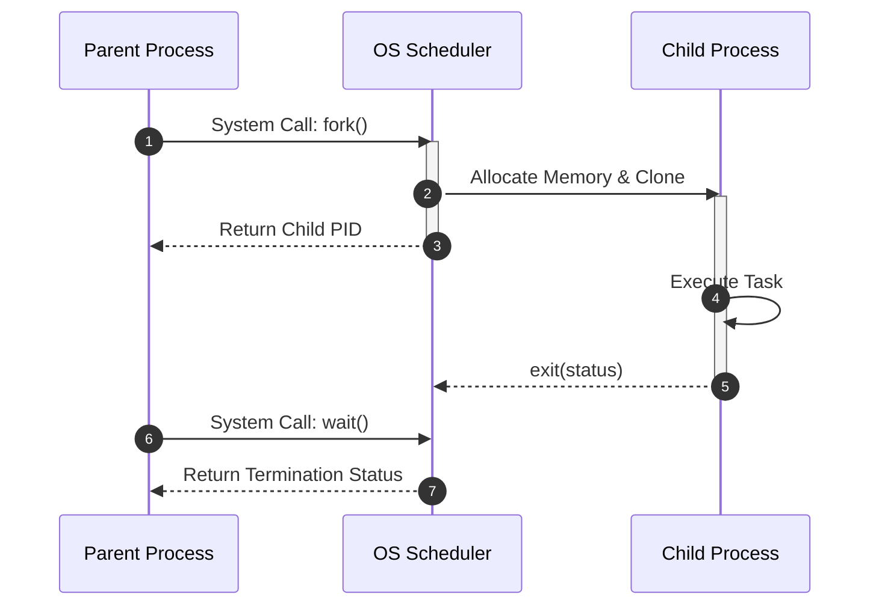
```mermaid
sequenceDiagram
    autonumber
    participant Parent Process
    participant OS Scheduler
    participant Child Process
    
    Parent Process->>OS Scheduler: System Call: fork()
    activate OS Scheduler
    OS Scheduler->>Child Process: Allocate Memory & Clone
    activate Child Process
    OS Scheduler-->>Parent Process: Return Child PID
    deactivate OS Scheduler
    
    Child Process->>Child Process: Execute Task
    Child Process-->>OS Scheduler: exit(status)
    deactivate Child Process
    
    Parent Process->>OS Scheduler: System Call: wait()
    OS Scheduler-->>Parent Process: Return Termination Status

```

---

## 🏗️ 4. Class Diagrams

Class diagrams are essential in Software Engineering and Object-Oriented Programming (OOP) to show system structure by detailing classes, attributes, methods, and relationships.

### Class Anatomy

* `+` : Public
* `-` : Private
* `#` : Protected

### Relationships

* `<|--` : **Inheritance** * `o--` : **Aggregation** (Weak relationship)
* `*--` : **Composition** (Strong relationship)

### Example: PID Line-Following Robot Architecture

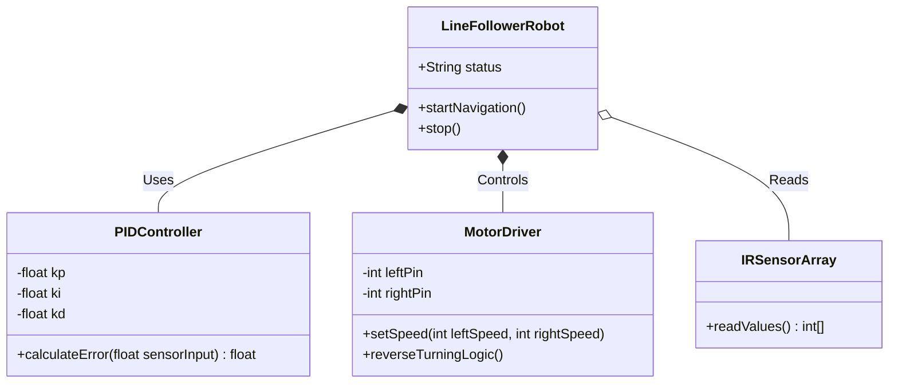
```mermaid
classDiagram
    class LineFollowerRobot {
        +String status
        +startNavigation()
        +stop()
    }
    
    class PIDController {
        -float kp
        -float ki
        -float kd
        +calculateError(float sensorInput) float
    }
    
    class MotorDriver {
        -int leftPin
        -int rightPin
        +setSpeed(int leftSpeed, int rightSpeed)
        +reverseTurningLogic()
    }
    
    class IRSensorArray {
        +readValues() int[]
    }

    LineFollowerRobot *-- PIDController : Uses
    LineFollowerRobot *-- MotorDriver : Controls
    LineFollowerRobot o-- IRSensorArray : Reads

```

---

## 🗄️ 5. Entity Relationship Diagrams (ERD)

ERDs are used in Database Management Systems (DBMS) to show how tables (entities) relate to one another.

### Cardinality (Crow's Foot Notation)

* `||--o{` : **One to Zero-or-Many** * `||--||` : **Exactly One to Exactly One** * `}o--o{` : **Many to Many** ### Example: University Registration System

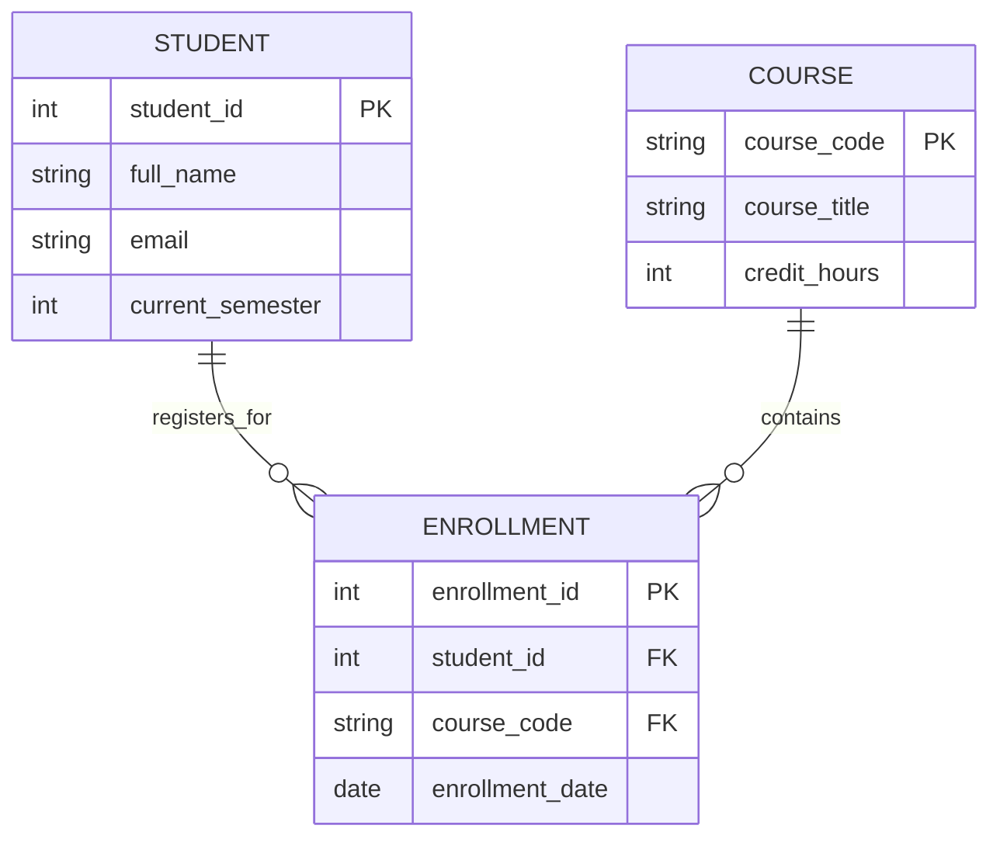
```mermaid
erDiagram
    STUDENT ||--o{ ENROLLMENT : registers_for
    COURSE ||--o{ ENROLLMENT : contains
    
    STUDENT {
        int student_id PK
        string full_name
        string email
        int current_semester
    }
    
    COURSE {
        string course_code PK
        string course_title
        int credit_hours
    }
    
    ENROLLMENT {
        int enrollment_id PK
        int student_id FK
        string course_code FK
        date enrollment_date
    }

```

---

## 🎁 Bonus: Pie Charts

Pie charts are incredibly easy to format. Just provide the title and the key-value pairs.

### Example: Algorithm Performance Distribution

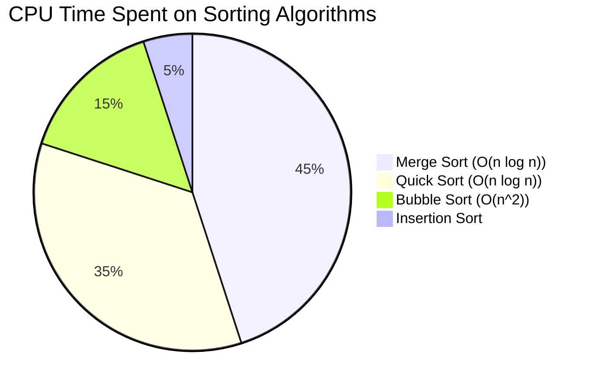
```mermaid
pie title CPU Time Spent on Sorting Algorithms
    "Merge Sort (O(n log n))" : 45
    "Quick Sort (O(n log n))" : 35
    "Bubble Sort (O(n^2))" : 15
    "Insertion Sort" : 5

```

---

# 🎨 The Mermaid.js Masterclass: Styling, Advanced Diagrams, and System Architecture

Mermaid is not just for black-and-white boxes. It contains a powerful rendering engine that supports CSS styling, complex logic flows, and project management tools.

## 🖌️ Part 1: The Art of Styling Nodes & Links

You can color-coordinate your flowcharts to make them readable at a glance. There are two main ways to do this: Inline Styling and Class-Based Styling.

### Method A: Inline Styling (`style`)

You apply CSS directly to a specific node using its ID.

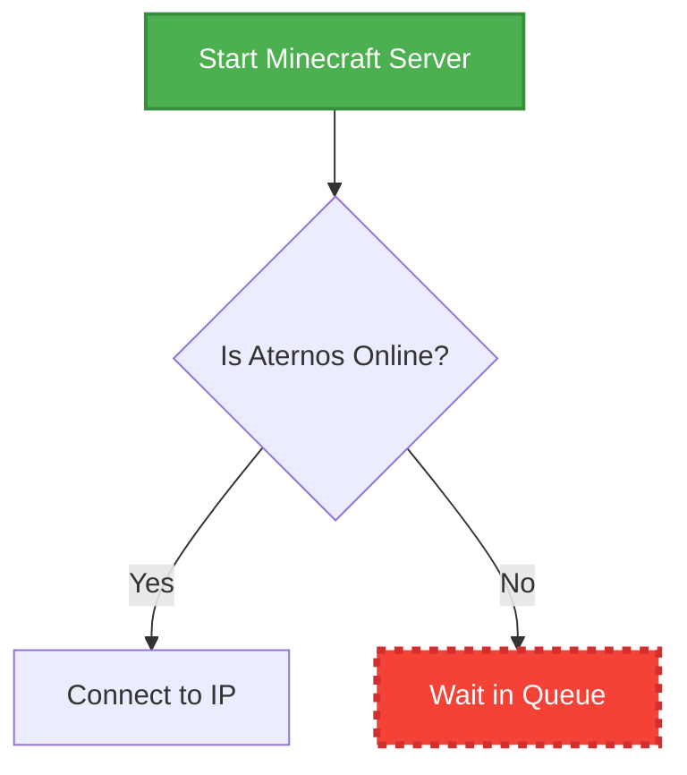
```mermaid
flowchart TD
    A[Start Minecraft Server] --> B{Is Aternos Online?}
    B -->|Yes| C[Connect to IP]
    B -->|No| D[Wait in Queue]

    style A fill:#4CAF50,stroke:#388E3C,stroke-width:2px,color:#fff
    style D fill:#F44336,stroke:#D32F2F,stroke-width:4px,color:#fff,stroke-dasharray: 5 5

```

* `fill`: The background color (hex codes work best).
* `stroke`: The border color.
* `stroke-width`: Border thickness.
* `color`: Text color.
* `stroke-dasharray`: Creates dotted/dashed borders.

### Method B: Class-Based Styling (`classDef` & `class`)

If you have multiple nodes that need the same style (e.g., all database nodes are blue, all error nodes are red), inline styling is too slow. Instead, define a class and apply it.

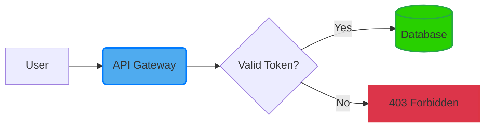
```mermaid
flowchart LR
    classDef success fill:#28d000,stroke:#28a745,stroke-width:2px;
    classDef error fill:#dc354a,stroke:#dc3545,stroke-width:2px;
    classDef process fill:#4fabef,stroke:#007bff,stroke-width:2px;

    User --> API(API Gateway):::process
    API --> Auth{Valid Token?}
    Auth -->|Yes| DB[(Database)]:::success
    Auth -->|No| Reject[403 Forbidden]:::error

```

* Define the class: `classDef [className] [cssProperties]`
* Apply the class directly: Add `:::[className]` to the end of the node definition.

---

## 📦 Part 2: Subgraphs (Grouping Components)

Subgraphs allow you to group related nodes together inside a larger bounding box. This is crucial for visualizing software architecture or separating different systems.

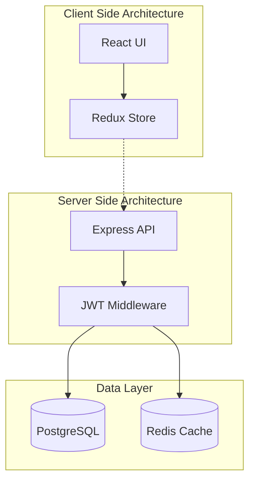
```mermaid
flowchart TD
    subgraph Frontend [Client Side Architecture]
        UI[React UI] --> State[Redux Store]
    end

    subgraph Backend [Server Side Architecture]
        API[Express API] --> Auth[JWT Middleware]
    end

    subgraph Infrastructure [Data Layer]
        DB[(PostgreSQL)]
        Cache[(Redis Cache)]
    end

    State -.-> API
    Auth --> DB
    Auth --> Cache

```

* Use `subgraph [ID] [Optional Title]` to open the group.
* Use `end` to close it.
* Notice the `-.->` arrow? That creates a **dotted link** instead of a solid one.

---

## 🔄 Part 3: Advanced Sequence Diagrams

Sequence diagrams can handle complex logic like `if/else` statements, loops, and parallel processes using specialized blocks.

### Loops, Alt (If/Else), and Opt (Optional)

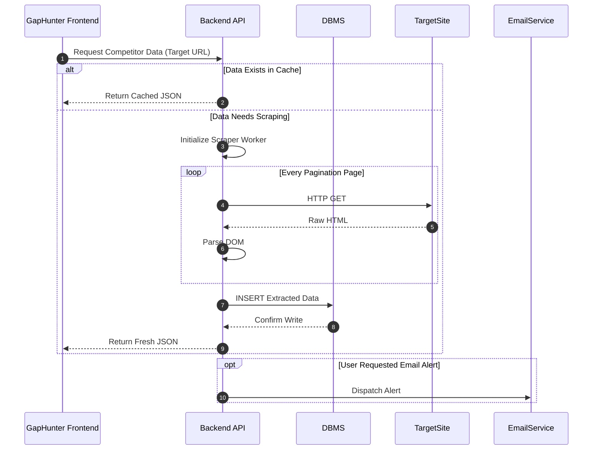
```mermaid
sequenceDiagram
    autonumber
    participant Client as GapHunter Frontend
    participant Server as Backend API
    participant DB as DBMS
    
    Client->>Server: Request Competitor Data (Target URL)
    
    alt Data Exists in Cache
        Server-->>Client: Return Cached JSON
    else Data Needs Scraping
        Server->>Server: Initialize Scraper Worker
        
        loop Every Pagination Page
            Server->>TargetSite: HTTP GET
            TargetSite-->>Server: Raw HTML
            Server->>Server: Parse DOM
        end
        
        Server->>DB: INSERT Extracted Data
        DB-->>Server: Confirm Write
        Server-->>Client: Return Fresh JSON
    end
    
    opt User Requested Email Alert
        Server->>EmailService: Dispatch Alert
    end

```

* `alt ... else ... end`: Represents conditional logic (If this, do X, else do Y).
* `loop ... end`: Represents an iterative process.
* `opt ... end`: Represents an optional step that only occurs under certain conditions.

---

## 🚦 Part 4: State Diagrams

State diagrams are used to describe the behavior of a system in terms of its states and the transitions between them. They are heavily used in hardware, robotics, and game development.

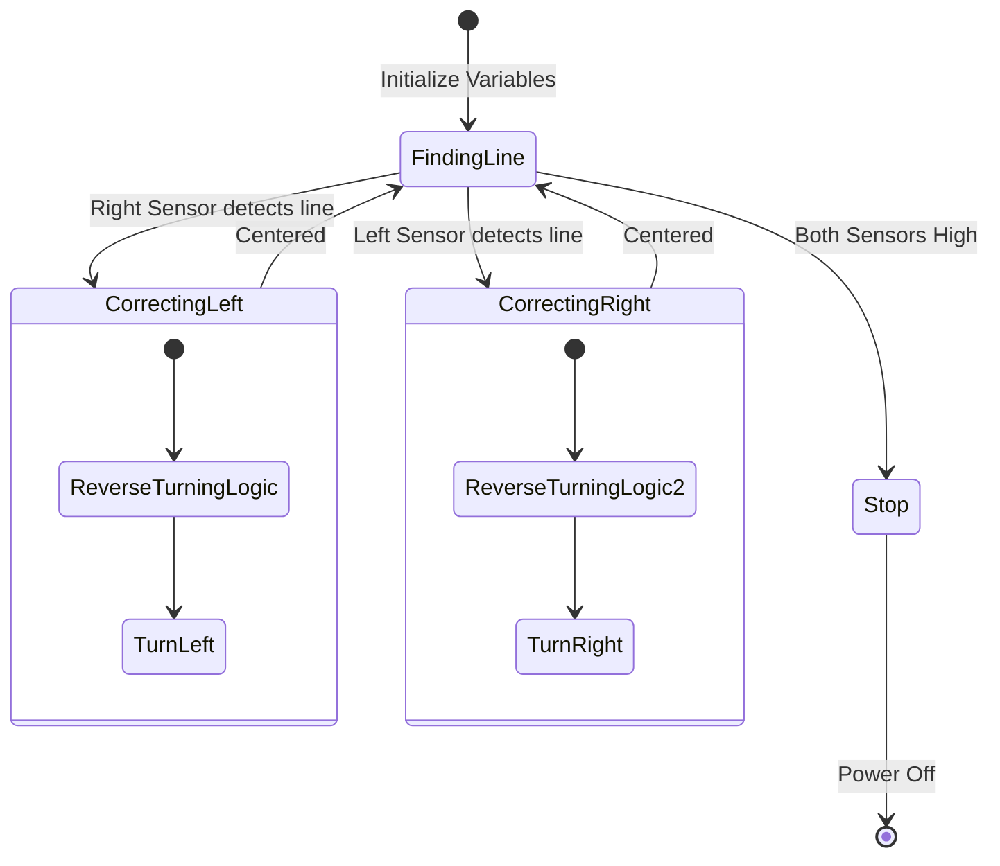
```mermaid
stateDiagram-v2
    [*] --> FindingLine : Initialize Variables
    
    FindingLine --> CorrectingLeft : Right Sensor detects line
    FindingLine --> CorrectingRight : Left Sensor detects line
    
    state CorrectingLeft {
        [*] --> ReverseTurningLogic
        ReverseTurningLogic --> TurnLeft
    }
    
    state CorrectingRight {
        [*] --> ReverseTurningLogic2
        ReverseTurningLogic2 --> TurnRight
    }
    
    CorrectingLeft --> FindingLine : Centered
    CorrectingRight --> FindingLine : Centered
    FindingLine --> Stop : Both Sensors High
    Stop --> [*] : Power Off

```

* `[*]`: Represents the start or end point.
* `-->`: The transition between states.
* You can nest states within other states for complex state machines (like the correcting logic above).

---

## 📅 Part 5: Gantt Charts (Project Planning)

Mermaid can render standard Gantt charts, which are excellent for tracking semester projects, sprints, or personal goals.

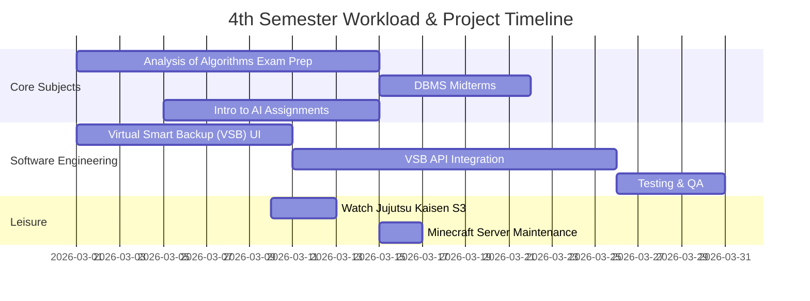
```mermaid
gantt
    title 4th Semester Workload & Project Timeline
    dateFormat  YYYY-MM-DD
    section Core Subjects
    Analysis of Algorithms Exam Prep  :a1, 2026-03-01, 14d
    DBMS Midterms                     :a2, after a1, 7d
    Intro to AI Assignments           :a3, 2026-03-05, 10d
    
    section Software Engineering
    Virtual Smart Backup (VSB) UI     :b1, 2026-03-01, 10d
    VSB API Integration               :b2, after b1, 15d
    Testing & QA                      :b3, after b2, 5d
    
    section Leisure
    Watch Jujutsu Kaisen S3           :c1, 2026-03-10, 3d
    Minecraft Server Maintenance      :c2, 2026-03-15, 2d

```

* `dateFormat`: Tells Mermaid how to read your dates.
* `section`: Groups tasks together.
* `[Task Name] : [ID], [Start Date], [Duration]`
* You can use `after [ID]` to make tasks sequential automatically.

---

## 🔀 Part 6: Git Graphs

If you are working on software, understanding branching is key. Mermaid has a dedicated graph type for visualizing Git version control history.

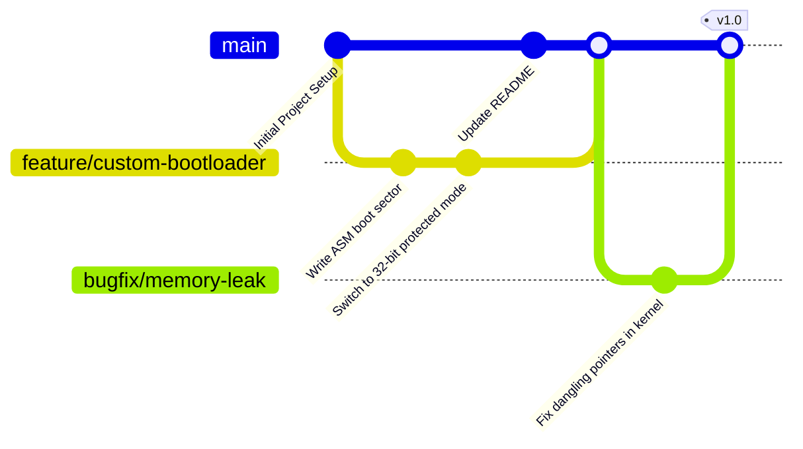
```mermaid
gitGraph
    commit id: "Initial Project Setup"
    branch feature/custom-bootloader
    checkout feature/custom-bootloader
    commit id: "Write ASM boot sector"
    commit id: "Switch to 32-bit protected mode"
    checkout main
    commit id: "Update README"
    merge feature/custom-bootloader
    branch bugfix/memory-leak
    checkout bugfix/memory-leak
    commit id: "Fix dangling pointers in kernel"
    checkout main
    merge bugfix/memory-leak tag: "v1.0"

```

* `commit id: "..."`: Creates a node on the current branch.
* `branch [name]`: Creates a new line.
* `checkout [name]`: Switches the active context to that branch.
* `merge [name]`: Brings the branch back into the current active branch.

---

## 🔗 Part 7: Interactive Flowcharts (Clickable Nodes)

You can turn any node in a flowchart into a clickable hyperlink. This is incredibly useful for documentation, linking a high-level architecture diagram directly to specific GitHub repositories or Jira tickets.

### Syntax

* `click [NodeID] "[URL]" "[Hover Text]"`

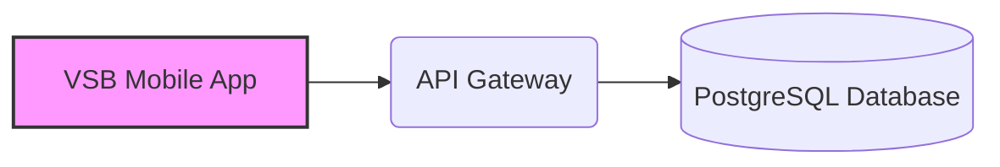
```mermaid
flowchart LR
    A[VSB Mobile App] --> B(API Gateway)
    B --> C[(PostgreSQL Database)]

    %% The lines below make the nodes clickable!
    click A "https://github.com/yourusername/vsb-app" "Go to Frontend Repo"
    click B "https://github.com/yourusername/vsb-api" "Go to Backend Repo"
    
    style A fill:#f9f,stroke:#333,stroke-width:2px

```

*(Note: Clicking works in the Mermaid Live Editor and most markdown previews, though exact behavior depends on your VS Code security settings).*

---

## 🧠 Part 8: Mindmaps

Mindmaps are fantastic for brainstorming, breaking down complex topics, or mapping out the module structure of a large software application. They rely purely on **indentation** to determine the hierarchy.

### Example: Structuring a Unified Engineering Environment

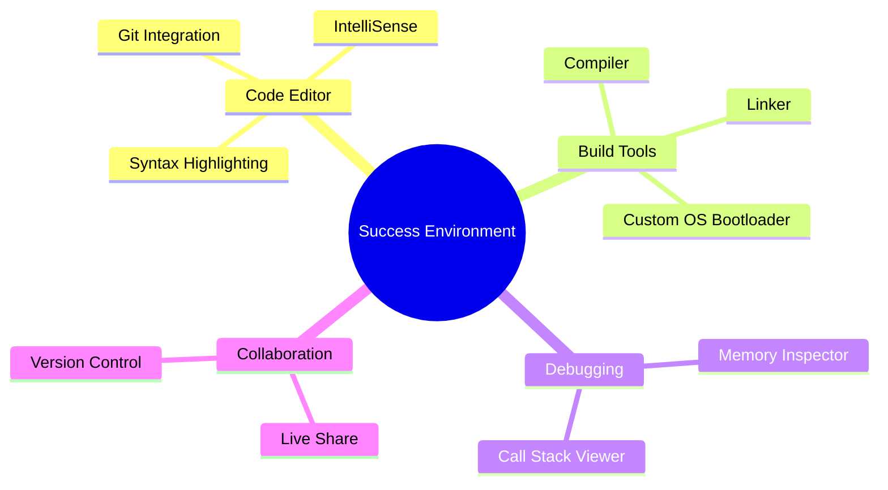
```mermaid
mindmap
  root((Success Environment))
    Code Editor
      Syntax Highlighting
      IntelliSense
      Git Integration
    Build Tools
      Compiler
      Linker
      Custom OS Bootloader
    Debugging
      Memory Inspector
      Call Stack Viewer
    Collaboration
      Live Share
      Version Control

```

* Use `mindmap` to declare the graph type.
* The `root` is the center circle.
* Press `Tab` or `Space` to indent. Everything indented under a node becomes a branch of that node.
* You can change node shapes just like flowcharts (e.g., `[Square]`, `(Rounded)`, `((Circle))`).

---

## 🎯 Part 9: Quadrant Charts

Quadrant charts divide a 2D space into four areas. They are essential for competitive analysis, feature prioritization (Impact vs. Effort), or risk assessment.

### Example: Competitive Analysis for a Scraping Tool

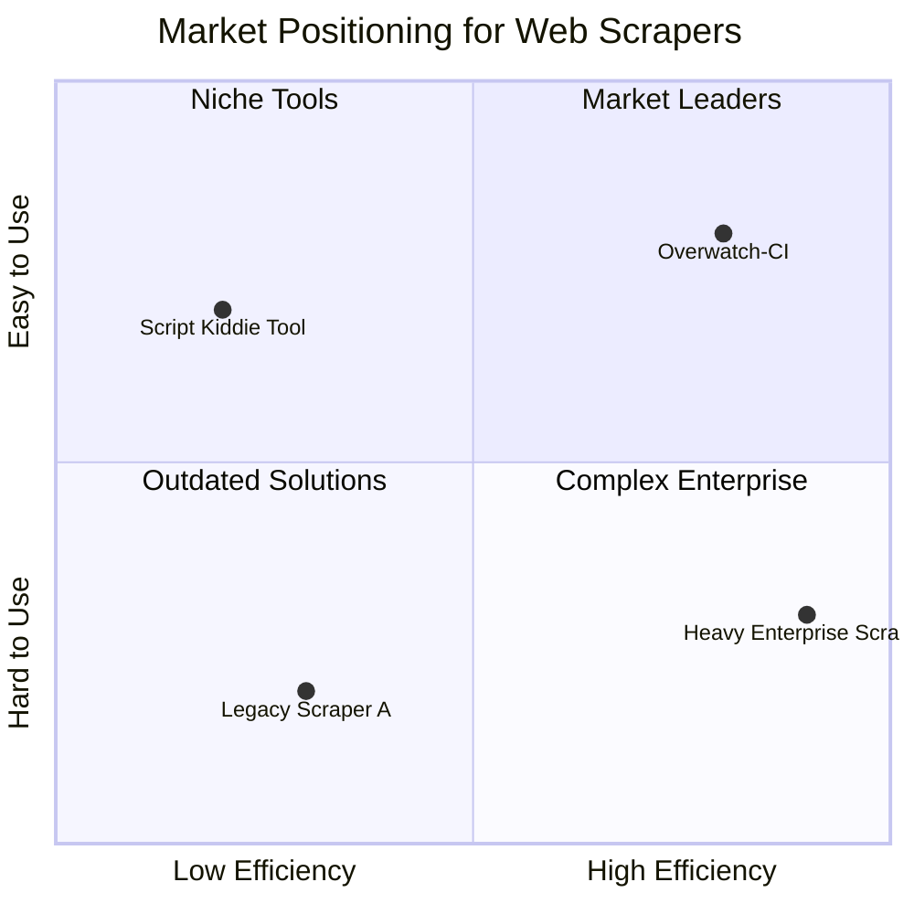
```mermaid
quadrantChart
    title Market Positioning for Web Scrapers
    x-axis Low Efficiency --> High Efficiency
    y-axis Hard to Use --> Easy to Use
    quadrant-1 Market Leaders
    quadrant-2 Niche Tools
    quadrant-3 Outdated Solutions
    quadrant-4 Complex Enterprise
    
    Overwatch-CI: [0.8, 0.8]
    Legacy Scraper A: [0.3, 0.2]
    Script Kiddie Tool: [0.2, 0.7]
    Heavy Enterprise Scraper: [0.9, 0.3]

```

* `x-axis` and `y-axis`: Define the scales.
* `quadrant-1` to `quadrant-4`: Name the four boxes (Top-Right, Top-Left, Bottom-Left, Bottom-Right).
* `[0.0 to 1.0, 0.0 to 1.0]`: Plot your specific data points on an X/Y scale. `[0.8, 0.8]` puts it high and to the right.

---

## 📋 Part 10: Requirement Diagrams

Requirement diagrams are used heavily in Systems Engineering to map out exactly what a system *must* do and trace those requirements to specific components.

### Syntax

* `requirement`: Defines the rule.
* `element`: Defines the physical/software part.
* `- satisfies ->`: Links the element to the requirement it fulfills.

### Example: B2B Lead Generation Tool

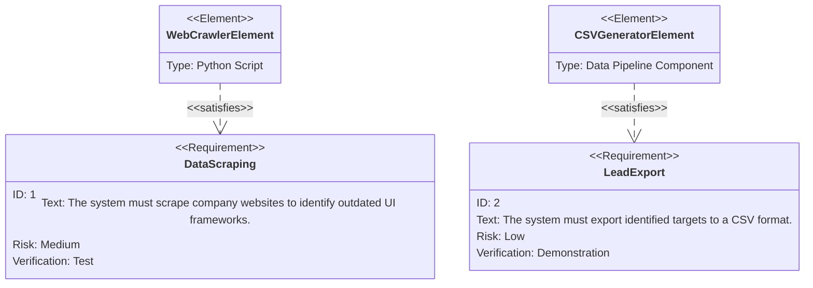
```mermaid
requirementDiagram

    requirement DataScraping {
        id: 1
        text: The system must scrape company websites to identify outdated UI frameworks.
        risk: medium
        verifyMethod: test
    }

    requirement LeadExport {
        id: 2
        text: The system must export identified targets to a CSV format.
        risk: low
        verifyMethod: demonstration
    }

    element WebCrawlerElement {
        type: Python Script
    }

    element CSVGeneratorElement {
        type: Data Pipeline Component
    }

    WebCrawlerElement - satisfies -> DataScraping
    CSVGeneratorElement - satisfies -> LeadExport

```

---

## ⏳ Part 11: Timelines

Timelines are perfect for showing a chronological sequence of events. You can use them for historical project milestones, product roadmaps, or even tracking the release order of your favorite media.

### Example: Shonen Anime Progression

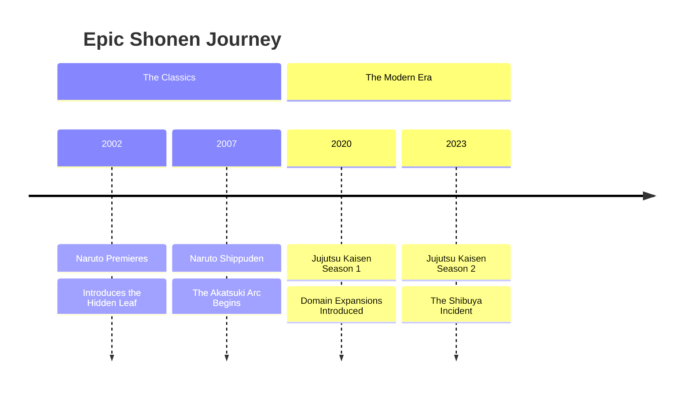
```mermaid
timeline
    title Epic Shonen Journey
    section The Classics
        2002 : Naruto Premieres
             : Introduces the Hidden Leaf
        2007 : Naruto Shippuden
             : The Akatsuki Arc Begins
    section The Modern Era
        2020 : Jujutsu Kaisen Season 1
             : Domain Expansions Introduced
        2023 : Jujutsu Kaisen Season 2
             : The Shibuya Incident

```

* `timeline`: The starting keyword.
* `section`: Groups events together (creates a larger colored block).
* `[Time Period] : [Event 1] : [Event 2]`: Maps the data to the timeline.

---

## 🗺️ Part 12: User Journeys

User Journeys map out the exact steps a person takes to achieve a goal within a system, rating their "experience" at each step.

### Syntax

* `journey`: Starts the graph.
* `title`: Names the journey.
* `section`: Groups tasks.
* `[Task Name]: [Score 1-5]: [Actor]`

### Example: App Backup Process

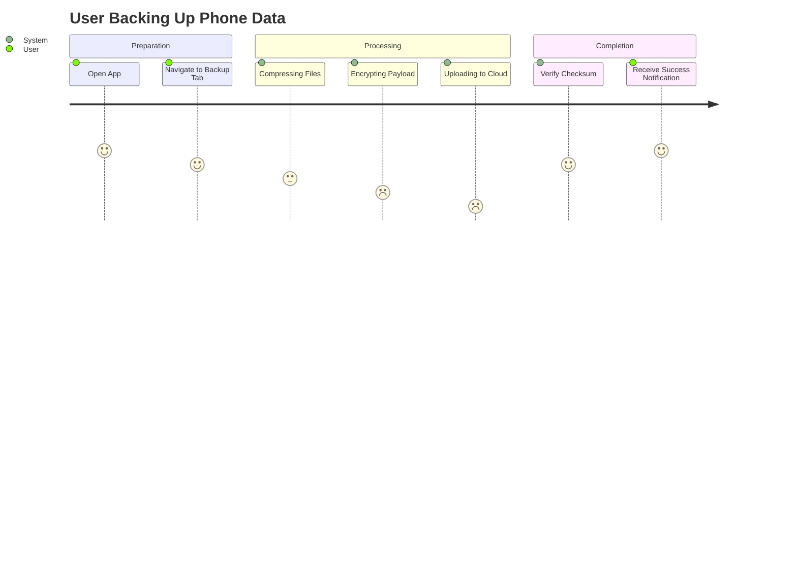
```mermaid
journey
    title User Backing Up Phone Data
    section Preparation
      Open App: 5: User
      Navigate to Backup Tab: 4: User
    section Processing
      Compressing Files: 3: System
      Encrypting Payload: 2: System
      Uploading to Cloud: 1: System
    section Completion
      Verify Checksum: 4: System
      Receive Success Notification: 5: User

```

*(Notice the scores 1 through 5? A score of 5 renders with a happy face and high placement, while a 1 renders with a sad face, showing where users or systems might get frustrated or bogged down).*

---

This gives you a massive arsenal of diagraming capabilities right inside your code editor.

---

## 🏗️ Part 13: C4 Architecture Diagrams

The C4 model is an industry standard in Software Engineering for visualizing software architecture at different levels of zoom (Context, Containers, Components, and Code). Mermaid natively supports C4 diagrams.

### Example: Virtual Smart Backup (VSB) System Context

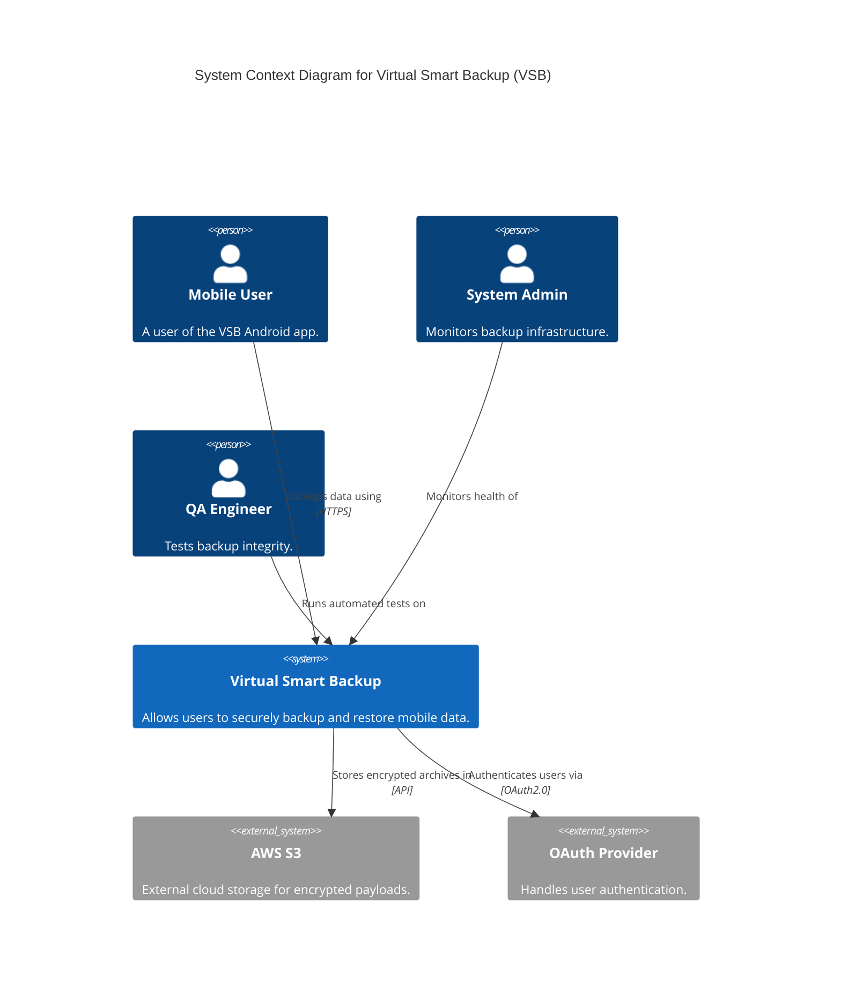
```mermaid
C4Context
    title System Context Diagram for Virtual Smart Backup (VSB)
    
    Person(user_hammad, "Mobile User", "A user of the VSB Android app.")
    Person(admin_omar, "System Admin", "Monitors backup infrastructure.")
    Person(dev_ayesha, "QA Engineer", "Tests backup integrity.")
    
    System(vsb_system, "Virtual Smart Backup", "Allows users to securely backup and restore mobile data.")
    
    System_Ext(cloud_storage, "AWS S3", "External cloud storage for encrypted payloads.")
    System_Ext(auth_provider, "OAuth Provider", "Handles user authentication.")
    
    Rel(user_hammad, vsb_system, "Backups data using", "HTTPS")
    Rel(admin_omar, vsb_system, "Monitors health of")
    Rel(dev_ayesha, vsb_system, "Runs automated tests on")
    
    Rel(vsb_system, cloud_storage, "Stores encrypted archives in", "API")
    Rel(vsb_system, auth_provider, "Authenticates users via", "OAuth2.0")

```

---

## 🌊 Part 14: Sankey Diagrams

Sankey diagrams are perfect for visualizing the flow of data, energy, or money. The width of the arrows is proportional to the flow quantity.

### Example: Overwatch-CI Data Scraping Pipeline

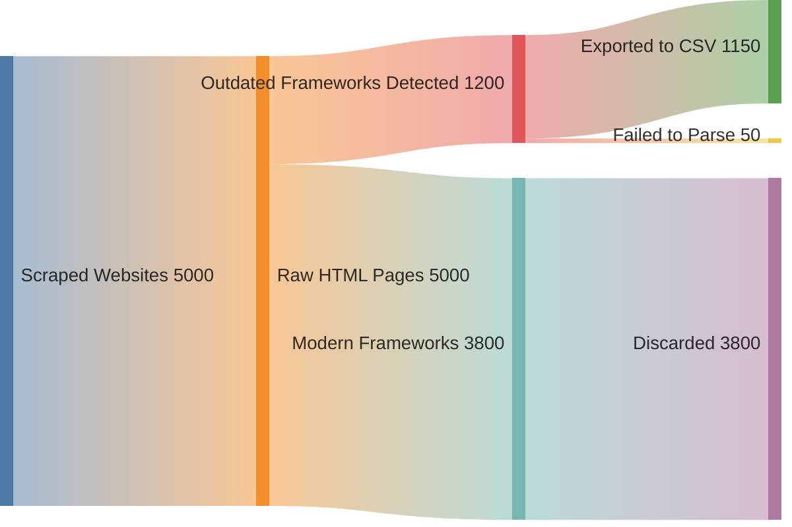
```mermaid
sankey-beta
    %% Syntax: Source, Target, Value
    Scraped Websites, Raw HTML Pages, 5000
    Raw HTML Pages, Outdated Frameworks Detected, 1200
    Raw HTML Pages, Modern Frameworks, 3800
    Outdated Frameworks Detected, Exported to CSV, 1150
    Outdated Frameworks Detected, Failed to Parse, 50
    Modern Frameworks, Discarded, 3800

```

---

## 📊 Part 15: XY Charts (Bar and Line Graphs)

You don't need Excel or Python just to plot simple data. Mermaid can generate clean Bar and Line charts directly in your Markdown.

### Example: Sorting Algorithm Benchmarks (Analysis of Algorithms)

```mermaid
xychart-beta
    title "Sorting Algorithm Execution Time (10k Elements)"
    x-axis "Algorithms" [Bubble, Insertion, Selection, Merge, Quick]
    y-axis "Time (ms)" 0 --> 150
    bar [120, 95, 105, 15, 12]
    line [120, 95, 105, 15, 12]

```

*(You can combine both `bar` and `line` in the same chart to emphasize the trend!)*

---

## 📦 Part 16: Packet Diagrams

If you are working with low-level systems, custom operating systems, or network protocols, Packet Diagrams allow you to visualize the exact bit-level layout of a data frame or memory segment.

### Example: Custom IPC Message Header Structure

```mermaid
packet-beta
    title Inter-Process Communication (IPC) Header Layout
    0-7: "Sender PID (8 bits)"
    8-15: "Receiver PID (8 bits)"
    16-23: "Message Type (8 bits)"
    24-31: "Payload Length (8 bits)"
    32-63: "Memory Address Pointer (32 bits)"

```

---

## 🧩 Part 17: Block Diagrams

Block diagrams are excellent for spatial mapping, such as laying out a UI wireframe, mapping out a custom PCB, or showing high-level system components grouped in a grid.

### Example: Line-Following Robot Hardware Layout

```mermaid
block-beta
    columns 3
    
    LeftSensor["Left IR Sensor"] space RightSensor["Right IR Sensor"]
    
    space Microcontroller["ESP32 / Arduino Brain"] space
    
    MotorDriver["L298N Motor Driver"]
    
    LeftMotor["Left DC Motor"] Battery["Li-Po Power Supply"] RightMotor["Right DC Motor"]
    
    %% Routing connections
    LeftSensor --> Microcontroller
    RightSensor --> Microcontroller
    Microcontroller --> MotorDriver
    Battery --> MotorDriver
    Battery --> Microcontroller
    MotorDriver --> LeftMotor
    MotorDriver --> RightMotor

```

---

## ⚙️ Part 18: Global Directives (Themes & Configs)

You can change the entire look and feel of your Mermaid diagrams by passing a "Directive" at the very top of your diagram block. This is how you force a diagram into Dark Mode, change the font, or tweak the main colors.

### Syntax

You wrap the JSON configuration in `%%{` and `}%%`.

```mermaid
%%{init: { 
  'theme': 'base', 
  'themeVariables': { 
    'primaryColor': '#ffaa00',
    'primaryTextColor': '#fff',
    'primaryBorderColor': '#7C0000',
    'lineColor': '#F8B229',
    'secondaryColor': '#006100',
    'tertiaryColor': '#fff'
  },
  'fontFamily': 'Fira Code, monospace'
}}%%

flowchart LR
    A[Start Game] --> B{Play Badminton?}
    B -->|Yes| C[Win Match]
    B -->|No| D[Study for Exams]

```

### Built-in Themes

If you don't want to define custom hex codes, Mermaid has 5 built-in themes you can easily switch between:

1. `default`
2. `dark` (Perfect for VS Code)
3. `neutral` (Great for printing to PDF)
4. `forest` (Greens and earthy tones)
5. `base` (The blank slate for your own variables, as used above)

**Example of a quick Dark Mode toggle:**
`%%{init: {'theme': 'dark'}}%%`

---

This officially covers the entire spectrum of what Mermaid is currently capable of rendering in VS Code! You now have a master document that ranges from basic flowcharts to complex software architecture and hardware schematics.