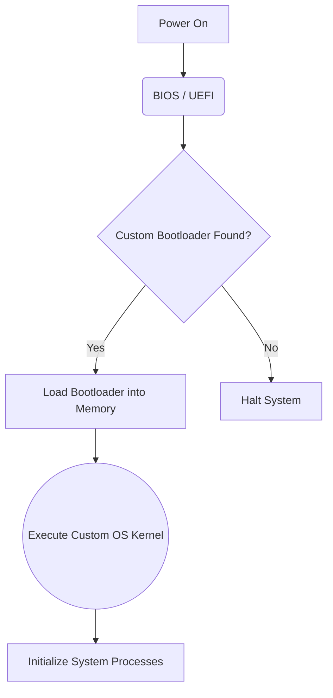
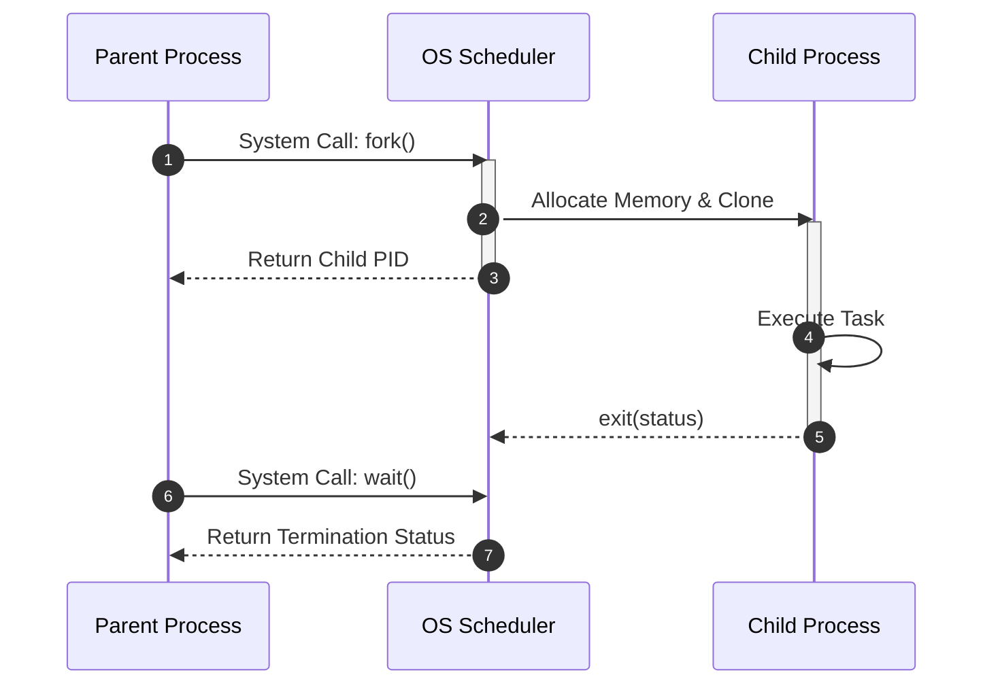
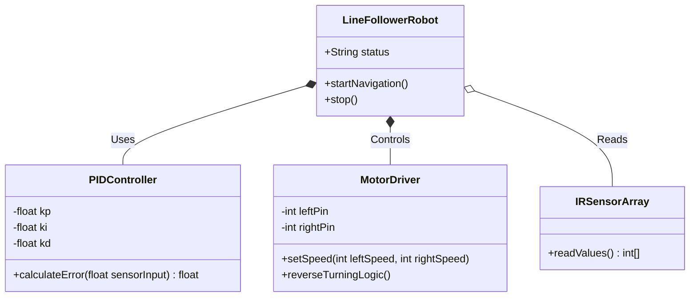
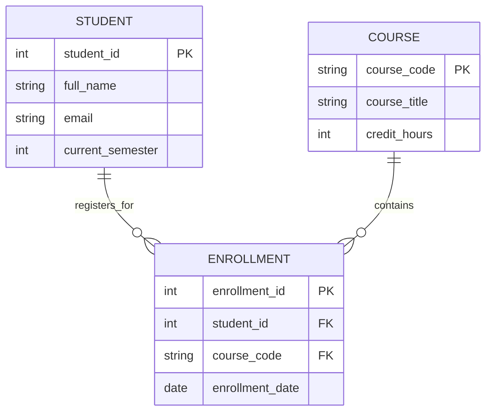
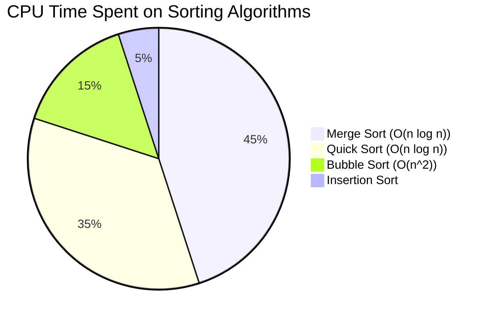

# 🧜‍♂️ The Ultimate Beginner's Guide to Mermaid.js

Mermaid is a JavaScript-based diagramming and charting tool that renders Markdown-inspired text definitions to create and modify diagrams dynamically. 

## 🛠️ 1. Environment Setup
To write and view Mermaid diagrams, you need an environment that supports it:
* **VS Code:** Install the **Markdown Preview Mermaid Support** extension. Create a `.md` file, write your code, and open the Markdown preview to see your diagrams live.
* **Browser:** Use the [Mermaid Live Editor](https://mermaid.live). It's great for quick testing, sharing links, and downloading your diagrams as PNG, SVG, or PDF files.

---

## 🌊 2. Flowcharts (Graphs)
Flowcharts are used to represent workflows, processes, or systems step-by-step.

### Defining the Direction
* `flowchart TD`: **T**op to **D**own (Vertical)
* `flowchart LR`: **L**eft to **R**ight (Horizontal)

### Example: Custom OS Boot Sequence


---

## ⏱️ 3. Sequence Diagrams

Sequence diagrams show how processes operate with one another and in what order. They are perfect for mapping out system interactions, API calls, or inter-process communication (IPC).

### Core Syntax

* `participant [Name]`: Defines the actors/systems.
* `->>`: Solid line with arrowhead (Message/Request).
* `-->>`: Dotted line with arrowhead (Response/Return).
* `activate` / `deactivate`: Creates a vertical box on the participant's lifeline to show active processing.

### Example: Inter-Process Communication (fork & wait)



---

## 🏗️ 4. Class Diagrams

Class diagrams are essential in Software Engineering and Object-Oriented Programming (OOP) to show system structure by detailing classes, attributes, methods, and relationships.

### Class Anatomy

* `+` : Public
* `-` : Private
* `#` : Protected

### Relationships

* `<|--` : **Inheritance** * `o--` : **Aggregation** (Weak relationship)
* `*--` : **Composition** (Strong relationship)

### Example: PID Line-Following Robot Architecture



---

## 🗄️ 5. Entity Relationship Diagrams (ERD)

ERDs are used in Database Management Systems (DBMS) to show how tables (entities) relate to one another.

### Cardinality (Crow's Foot Notation)

* `||--o{` : **One to Zero-or-Many** * `||--||` : **Exactly One to Exactly One** * `}o--o{` : **Many to Many** ### Example: University Registration System



---

## 🎁 Bonus: Pie Charts

Pie charts are incredibly easy to format. Just provide the title and the key-value pairs.

### Example: Algorithm Performance Distribution



```


```