# 🧜‍♂️ The Ultimate Beginner's Guide to Mermaid.js

Mermaid is a JavaScript-based diagramming and charting tool that renders Markdown-inspired text definitions to create and modify diagrams dynamically. 

## 🛠️ 1. Environment Setup
To write and view Mermaid diagrams, you need an environment that supports it:
* **VS Code:** Install the **Markdown Preview Mermaid Support** extension. Create a `.md` file, write your code, and open the Markdown preview to see your diagrams live.
* **Browser:** Use the [Mermaid Live Editor](https://mermaid.live). It's great for quick testing, sharing links, and downloading your diagrams as PNG, SVG, or PDF files.

---

## 🌊 2. Flowcharts (Graphs)
Flowcharts are used to represent workflows, processes, or systems step-by-step.

### Defining the Direction
* `flowchart TD`: **T**op to **D**own (Vertical)
* `flowchart LR`: **L**eft to **R**ight (Horizontal)

### Example: Custom OS Boot Sequence
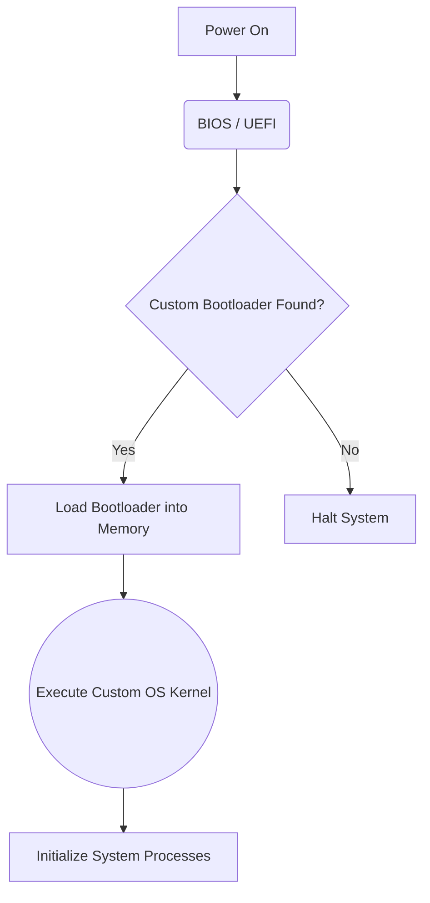

---

## ⏱️ 3. Sequence Diagrams

Sequence diagrams show how processes operate with one another and in what order. They are perfect for mapping out system interactions, API calls, or inter-process communication (IPC).

### Core Syntax

* `participant [Name]`: Defines the actors/systems.
* `->>`: Solid line with arrowhead (Message/Request).
* `-->>`: Dotted line with arrowhead (Response/Return).
* `activate` / `deactivate`: Creates a vertical box on the participant's lifeline to show active processing.

### Example: Inter-Process Communication (fork & wait)

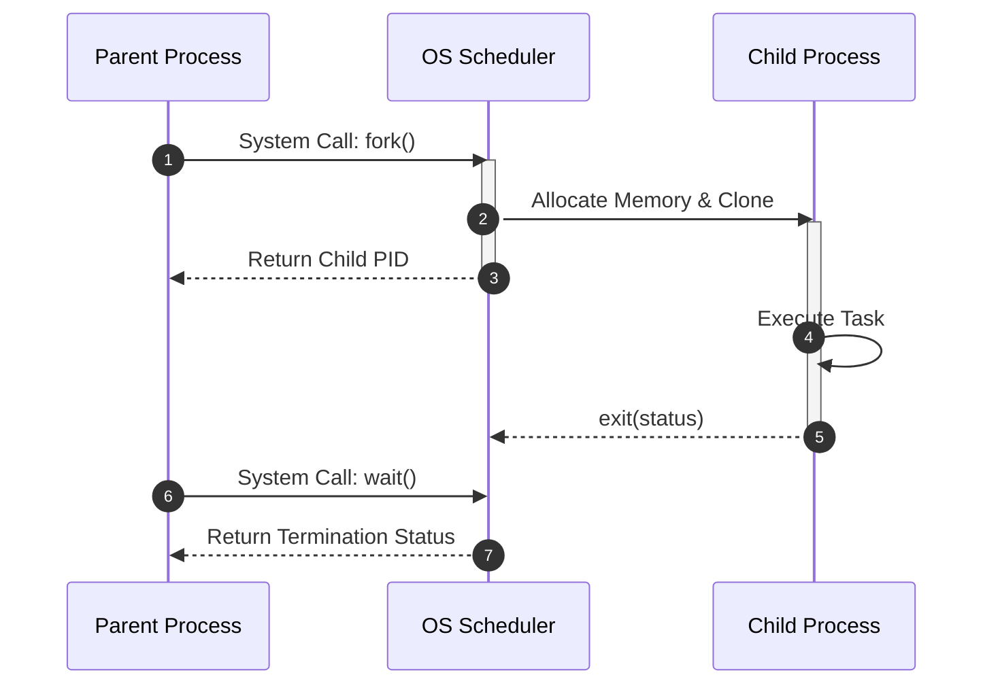

---

## 🏗️ 4. Class Diagrams

Class diagrams are essential in Software Engineering and Object-Oriented Programming (OOP) to show system structure by detailing classes, attributes, methods, and relationships.

### Class Anatomy

* `+` : Public
* `-` : Private
* `#` : Protected

### Relationships

* `<|--` : **Inheritance** * `o--` : **Aggregation** (Weak relationship)
* `*--` : **Composition** (Strong relationship)

### Example: PID Line-Following Robot Architecture

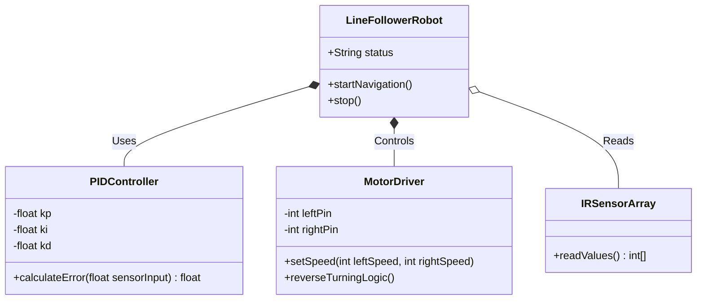

---

## 🗄️ 5. Entity Relationship Diagrams (ERD)

ERDs are used in Database Management Systems (DBMS) to show how tables (entities) relate to one another.

### Cardinality (Crow's Foot Notation)

* `||--o{` : **One to Zero-or-Many** * `||--||` : **Exactly One to Exactly One** * `}o--o{` : **Many to Many** ### Example: University Registration System

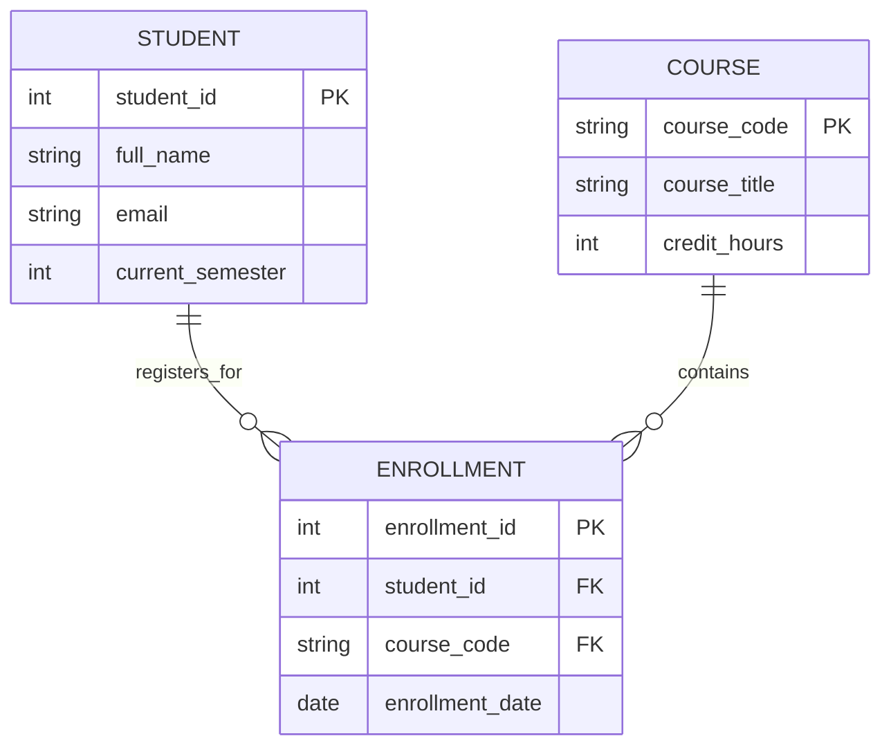

---

## 🎁 Bonus: Pie Charts

Pie charts are incredibly easy to format. Just provide the title and the key-value pairs.

### Example: Algorithm Performance Distribution

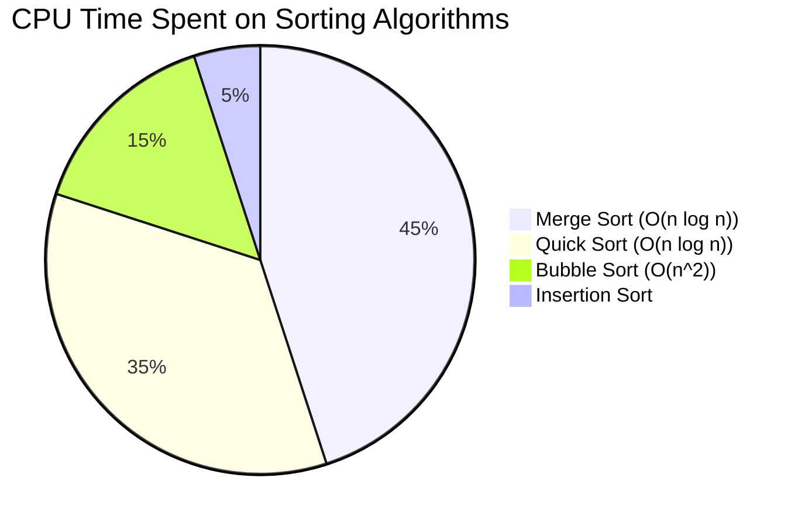

---

# 🎨 The Mermaid.js Masterclass: Styling, Advanced Diagrams, and System Architecture

Mermaid is not just for black-and-white boxes. It contains a powerful rendering engine that supports CSS styling, complex logic flows, and project management tools.

## 🖌️ Part 1: The Art of Styling Nodes & Links

You can color-coordinate your flowcharts to make them readable at a glance. There are two main ways to do this: Inline Styling and Class-Based Styling.

### Method A: Inline Styling (`style`)

You apply CSS directly to a specific node using its ID.

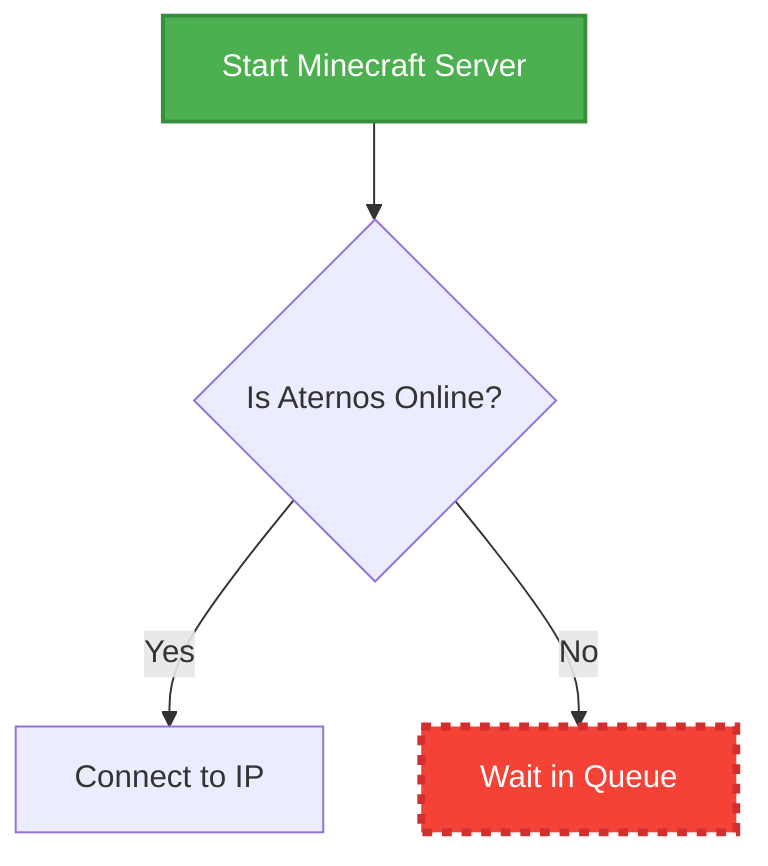

* `fill`: The background color (hex codes work best).
* `stroke`: The border color.
* `stroke-width`: Border thickness.
* `color`: Text color.
* `stroke-dasharray`: Creates dotted/dashed borders.

### Method B: Class-Based Styling (`classDef` & `class`)

If you have multiple nodes that need the same style (e.g., all database nodes are blue, all error nodes are red), inline styling is too slow. Instead, define a class and apply it.

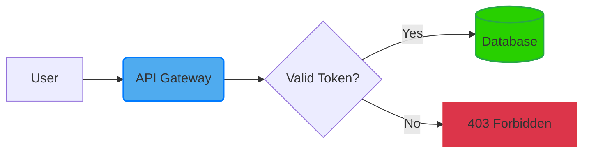

* Define the class: `classDef [className] [cssProperties]`
* Apply the class directly: Add `:::[className]` to the end of the node definition.

---

## 📦 Part 2: Subgraphs (Grouping Components)

Subgraphs allow you to group related nodes together inside a larger bounding box. This is crucial for visualizing software architecture or separating different systems.

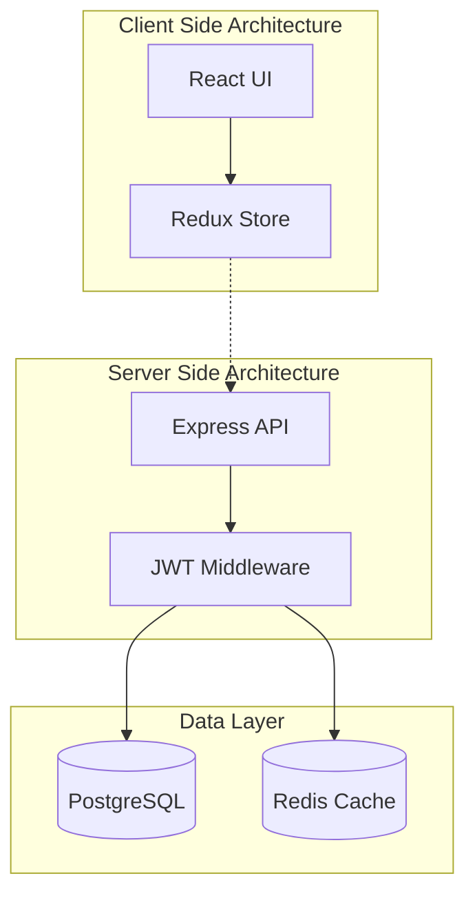

* Use `subgraph [ID] [Optional Title]` to open the group.
* Use `end` to close it.
* Notice the `-.->` arrow? That creates a **dotted link** instead of a solid one.

---

## 🔄 Part 3: Advanced Sequence Diagrams

Sequence diagrams can handle complex logic like `if/else` statements, loops, and parallel processes using specialized blocks.

### Loops, Alt (If/Else), and Opt (Optional)

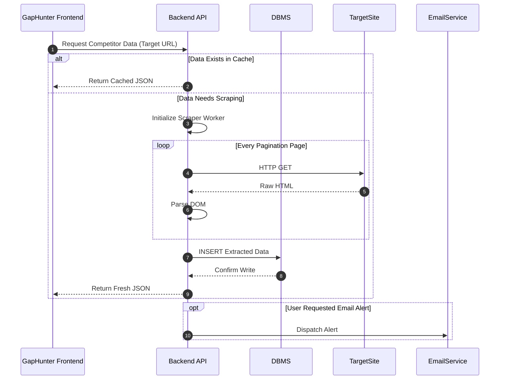

* `alt ... else ... end`: Represents conditional logic (If this, do X, else do Y).
* `loop ... end`: Represents an iterative process.
* `opt ... end`: Represents an optional step that only occurs under certain conditions.

---

## 🚦 Part 4: State Diagrams

State diagrams are used to describe the behavior of a system in terms of its states and the transitions between them. They are heavily used in hardware, robotics, and game development.

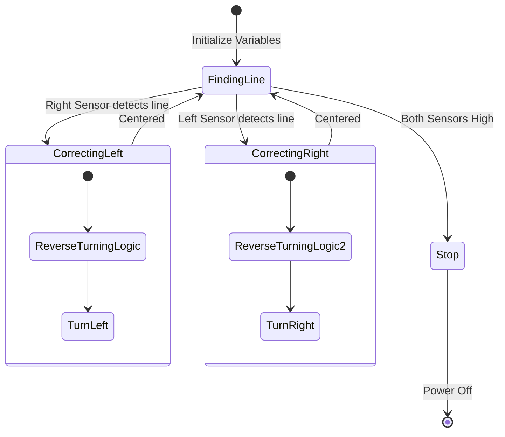

* `[*]`: Represents the start or end point.
* `-->`: The transition between states.
* You can nest states within other states for complex state machines (like the correcting logic above).

---

## 📅 Part 5: Gantt Charts (Project Planning)

Mermaid can render standard Gantt charts, which are excellent for tracking semester projects, sprints, or personal goals.

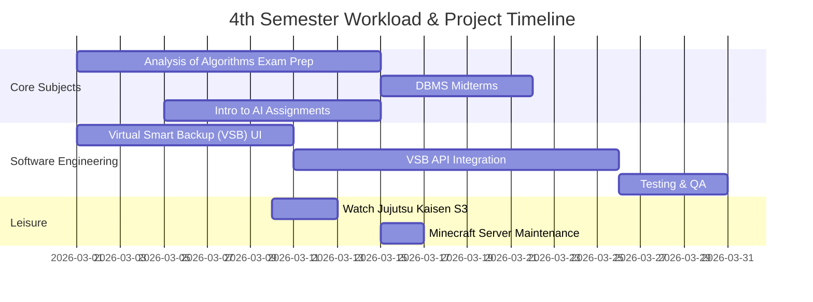

* `dateFormat`: Tells Mermaid how to read your dates.
* `section`: Groups tasks together.
* `[Task Name] : [ID], [Start Date], [Duration]`
* You can use `after [ID]` to make tasks sequential automatically.

---

## 🔀 Part 6: Git Graphs

If you are working on software, understanding branching is key. Mermaid has a dedicated graph type for visualizing Git version control history.

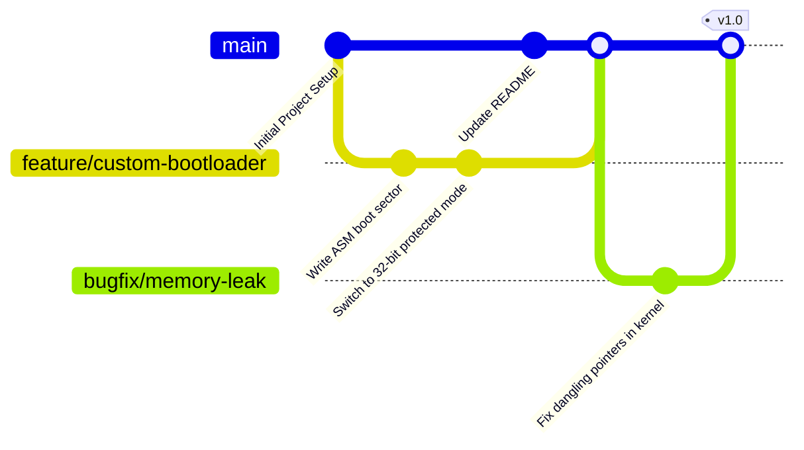

* `commit id: "..."`: Creates a node on the current branch.
* `branch [name]`: Creates a new line.
* `checkout [name]`: Switches the active context to that branch.
* `merge [name]`: Brings the branch back into the current active branch.

---

