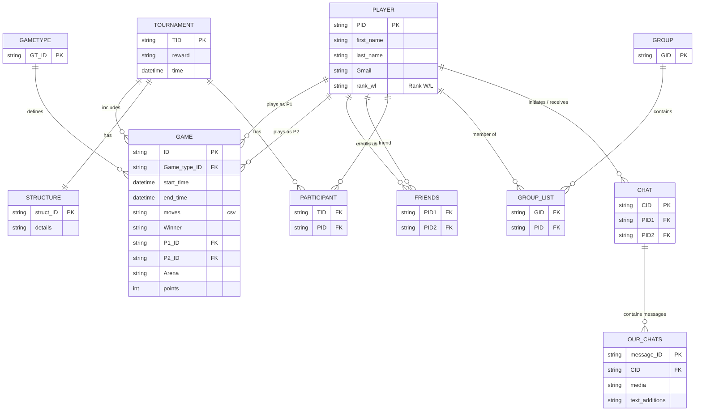

```mermaid
erDiagram
    %% Entities from both pages
    
    GAMETYPE {
        string GT_ID PK
    }

    GAME {
        string ID PK
        string Game_type_ID FK
        datetime start_time
        datetime end_time
        string moves "csv"
        string Winner
        string P1_ID FK
        string P2_ID FK
        string Arena
        int points
    }

    PLAYER {
        string PID PK
        string first_name
        string last_name
        string Gmail
        string rank_wl "Rank W/L"
    }

    %% Join table for Many-to-Many Friends relationship
    FRIENDS {
        string PID1 FK
        string PID2 FK
    }

    TOURNAMENT {
        string TID PK
        string reward
        datetime time
    }

    STRUCTURE {
        string struct_ID PK
        string details
    }

    %% Join table mapping Players to Tournaments
    PARTICIPANT {
        string TID FK
        string PID FK
    }

    GROUP {
        string GID PK
    }

    %% Join table mapping Players to Groups
    GROUP_LIST {
        string GID FK
        string PID FK
    }

    CHAT {
        string CID PK
        string PID1 FK
        string PID2 FK
    }

    OUR_CHATS {
        string message_ID PK
        string CID FK
        string media
        string text_additions
    }

    %% Relationships mapping

    GAMETYPE ||--o{ GAME : defines
    
    PLAYER ||--o{ GAME : "plays as P1"
    PLAYER ||--o{ GAME : "plays as P2"
    
    PLAYER ||--o{ FRIENDS : "is user"
    PLAYER ||--o{ FRIENDS : "is friend"
    
    TOURNAMENT ||--o{ GAME : "includes"
    TOURNAMENT ||--|| STRUCTURE : "has"
    TOURNAMENT ||--o{ PARTICIPANT : "has"
    PLAYER ||--o{ PARTICIPANT : "enrolls as"
    
    GROUP ||--o{ GROUP_LIST : "contains"
    PLAYER ||--o{ GROUP_LIST : "member of"
    
    PLAYER ||--o{ CHAT : "initiates / receives"
    CHAT ||--o{ OUR_CHATS : "contains messages"
```